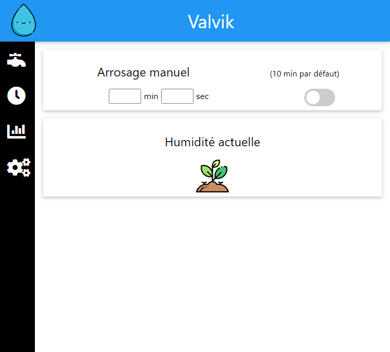
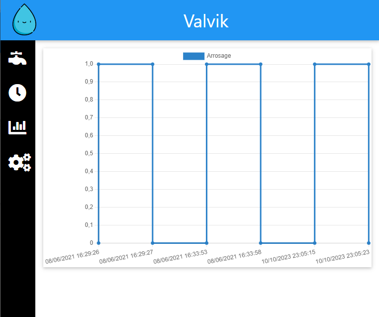
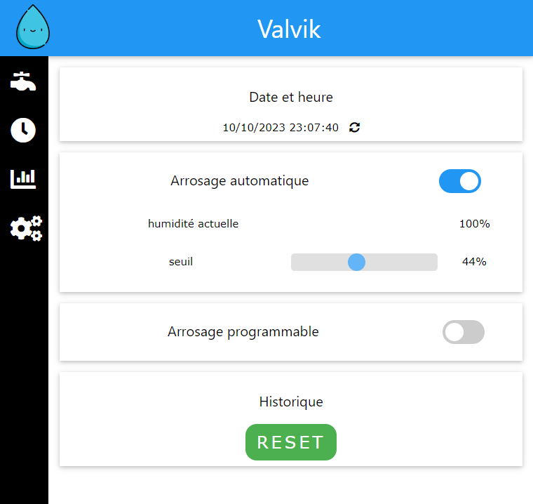

# Valvik

Valvik est un projet ESP qui permet de contrôler un système d'arrosage maison avec une électrovanne.
L'arrosage est controlable :
* Manuellement à partir de l'interface web
* Automatiquement à partir d'un capteur d'humidité
* Automatiquement en programmant des périodes d'arrosage

# Interface
L'interface est disponible en se connectant en wifi sur le point d'accès "Valvik" et en se rendant sur http://192.168.4.1

## Accueil

## Historique

## Réglages

